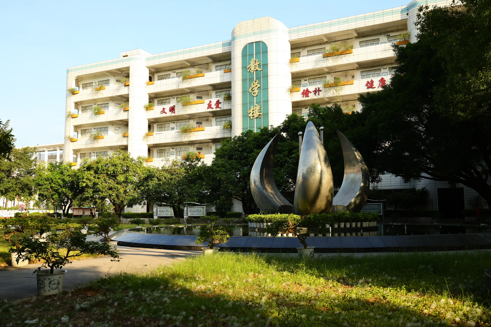

  

<h1 align="center">微光摄影社官网 · Glimmer Photography Agency</h1>

  
  
  

  <a href="https://lityzglimmer.top">🌐 在线浏览网站</a>　·　<a href="https://lityzglimmer.top/gallery.html">📷 直接进入作品集</a>

  <b>汇聚细碎光影，留存滚烫青春。</b> 
  以微小之姿看世界，以虔诚之姿定光影。

  

---

## 微光摄影社官网

柳铁一中**微光摄影社**的官方网站。社团拥有学校官方社团背书，但**由学生团队独立自主运营**——从拍摄、编辑、排版到上线部署，全部由社员自己完成。

网站取「明亮胶片感」的视觉语言：暖米白纸感背景、相纸白框、暗房红与暖金点缀，配合电影化的片头节奏，把一批社员原创实拍作品安放得安静而克制。

> 技术实现：纯静态站点，原生 HTML / CSS / JavaScript，无框架、无构建步骤，一键部署在 Vercel。

---

## 你会看到什么

网站按题材分为四个板块，目前共 **74 张**社员原创实拍作品：

| 板块 | 内容 |
| --- | --- |
| **校园纪实** | 高三喊楼的声浪、运动会的奔跑、校园四季的光影 |
| **校外采风** | 玉武三江的侗寨风雨桥、云雾梯田、赶集的人与采茶的少年 |
| **城市与远方** | 柳州街巷、柳江落日、山野与远方 |
| **人像与视觉** | 国风写真、自然光与逆光、舞台纪实、校园互拍（21 张） |

所有作品均为**社员原创实拍**，带有「微光」水印，禁止搬运与商用。

---

## 怎么逛这个网站

- **首页**：电影感大图轮播，四大板块的精选作品，以及社团自成立以来的「运行时长」计时器。
- **作品集**：按板块筛选作品，向下滚动分批加载；点开任意一张即可进入灯箱，**查看大图与拍摄信息**（机型、镜头、光圈、快门、ISO、焦段）。
- **关于我们**：社团的来历、创作理念、**四个部门的逐一介绍**，以及「零门槛、不唯设备」的招新态度与招募说明。
- **加入微光**：报名方式、入社流程与常见问题。
- **分享微光**：官方抖音与官方 QQ 的关注入口（附二维码），以及把本站分享出去的方式。

网站适配手机与平板，在任意屏幕宽度下都能完整浏览。

---

## 体验亮点

- **电影感 Hero 轮播**：首页大图缓慢推近（Ken Burns），交叉淡入，不抢内容。
- **瀑布流作品集**：横竖构图混排自适应，比例经过统一钳制，版面不参差。
- **分类筛选 + 灯箱**：按板块快速定位；灯箱里除了大图，还会展示这张照片的拍摄参数。
- **「运行时长」实时计时器**：自 2016-09-10 起实时走动，年 / 天 / 时 / 分 / 秒分层呈现，里程表式滚动。
- **胶片颗粒质感**：全局细微噪点覆膜，模拟胶片纹理。
- **响应式**：从桌面到手机，版式、字号、间距随屏幕自然收放。

---

## 更新记录

> 版本号规则：小修小补递增末位（如 1.4.1、1.4.2）；重大更新会以更醒目的方式呈现。

### v1.4.5 · 2026-10-01

- **调整**｜作品「雕塑光影」更名为「**校有萌猫**」（城市与远方）。
- **调整**｜作品「市集红蛋」更名为「**集市茶香**」（玉武三江）。
- **下架**｜隐藏作品「城市黄昏」（城市与远方）与「少女 · 黑衫」（人像）：条目改 `hidden: true`，数据与图片保留备用，作品集列表、分类计数与首页精选均已同步，**当前展出 74 张**。
- **修正**｜首页 Hero 第三屏文案「柳州 · 柳江之上」更正为「日落·龙江河之上」（龙江河不在柳州，去掉柳州前缀、保留河名与日落场景，与 hero-city.webp / city-01 同素材一致）；关于页配图说明「柳江落日」同步更正为「龙江河」。

### v1.4.4 · 2026-10-01

- **调整**｜作品「柳江落日 · 群峰剪影」更名为「**龙江河**」、「（红桥）龙江河」更名为「**文惠桥**」（城市与远方）——更正此前误记。
- **调整**｜作品「红竹笼」更名为「**茶罐 · 一味三江**」（玉武三江）——画面上铁罐印的「罐装你的梦想 / 追梦少年·三江研学」为照片内置文案，随图呈现。
- **调整**｜下架作品「晨光里的广场」（校园四季）与「蓝天白云」（城市与远方）：条目改为隐藏，数据与图片保留备用，作品集列表、分类计数与首页精选均已同步，**当前展出 76 张**。
- **优化**｜新增统一的「可见作品」出口（`works.js` 里的 `hidden: true` 即下架，无需改动各页面渲染逻辑），页头「本期展出」数量改为按实际可见作品自动计算。

### v1.4.3 · 2026-09-27

- **新增**｜社交分享预览：全部页面配置 Open Graph / Twitter Card 标签 + 1200×630 分享封面图（`assets/img/brand/og-cover.jpg`），把链接发到微信、QQ、抖音等平台时会显示标题、简介与封面卡片。
- **新增**｜搜索引擎基础：新增 `robots.txt` 与 `sitemap.xml`，首页加入 `Organization` 结构化数据（JSON-LD）。
- **修复**｜统一各页 `canonical` 与分享地址指向正式域名 `https://lityzglimmer.top`。

### v1.4.2 · 2026-09-27

- **修复**｜抖音二维码重新裁切：此前裁得过紧、切到码盘外圈导致扫不出；本次完整保留整个码盘并补足四周留白，可正常扫码。
- **调整**｜「分享微光」页移除「复制分享文案」按钮，仅保留「复制本站链接」。
- **调整**｜QQ 二维码下方注明「请使用 QQ 扫一扫」；渠道标题去掉重复的「官方 QQ」。

### v1.4.1 · 2026-09-27

- **修复**｜抖音二维码在页面上过小、不易扫出——整体放大并支持点击放大查看，方便手机扫码。
- **修复**｜「复制本站链接 / 复制分享文案」在本地双击打开（file://）时无法复制——改为优先使用系统剪贴板、失败自动兜底，本地与线上都能用。
- **调整**｜官方 QQ 二维码更换为最新版；移除「加为好友」跳转按钮，统一改为扫码添加。
- **调整**｜「分享微光」页移除「分享到 QQ」入口，保留复制链接与复制分享文案。

### v1.4.0 · 2026-09-27

- **新增**｜「关于我们」新增「我们的部门」板块：摄影部、模特部、组织部、文编部四个部门的定位与工作内容逐一介绍。
- **新增**｜「关于我们」新增「招新」板块：招募对象、招新时间与报名方式一次说清，并接入官方 QQ 与抖音。
- **新增**｜独立页面「分享微光」：官方抖音（ltyz_GLIMMER）与官方 QQ（1159554310）的关注入口、二维码，以及一键分享到 QQ / 复制链接与分享文案的功能。
- **新增**｜导航与页脚新增「分享微光」入口。
- **新增**｜传播与版权说明：欢迎分享转发，请保留署名，禁止搬运、二改与商用。

### v1.3.0 · 2026-09-26

- **新增**｜人像作品第二批次上线：18 张社员原创实拍，站点作品总数增至 **78 张**、人像增至 21 张；首页新增「人像与视觉」独立板块。
- **新增**｜灯箱展示拍摄信息：自动读取每张照片的机型、镜头、光圈、快门、ISO、焦段与日期。
- **优化**｜首页大图轮播与作品灯箱的图片切换更顺滑，消除切换时的二次跳动。
- **优化**｜玉武三江板块主视觉替换为风雨桥上的迎宾队伍实拍。

### v1.2.0 · 2026-09-26

- **新增**｜「运行时长」实时计时器（关于页），自社团成立起实时走动，年 / 天 / 时 / 分 / 秒分层展示。
- **优化**｜计时器数字滚动顺序与流畅度修正，读数稳定不跳变。

### v1.1.0 · 2026-09-25

- **优化**｜作品替换为带水印版本，呈现更完整。

### v1.0.0 · 2026-09-25

- **新建**｜微光摄影社官网首版上线：首页 / 作品集 / 关于我们 / 加入微光四页，社团原创实拍作品上线。

---

## 声明

- 微光摄影社所有平台（抖音、官网、作品展示渠道）均为**学生自主运营**，拥有学校社团背书，**不属于学校官方平台**。所有内容、作品、活动、文案均由学生团队独立策划、拍摄、制作与负责。
- 站内全部作品为**社员原创实拍**，禁止搬运、二改与商用。

---

Designed & built by 柳铁一中微光摄影社 · 学生团队自主运营
